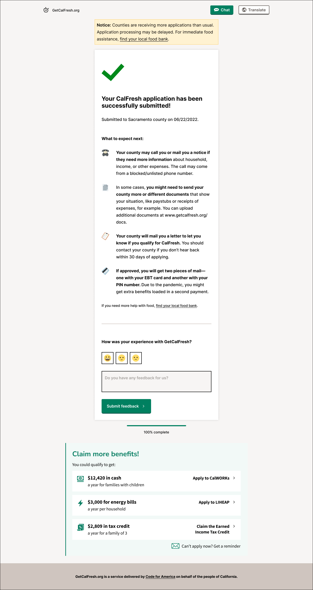

# Benefits recommendation widget

This is the frontend of a benefits recommender. It takes up a small amount of screen space to display a few links to State of California public 

Here is an early design mockup of the widget appearing on the final page of the getCalFresh application process: 



This is a web component designed to be used on many sites. It can accept information about the current visitor in order to make more informed decisions about which benefit application links to display.

It calls a backend API when it loads to retrieve the set of benefits links and language for its current placement

This widget will retrieve the following data points about its current placement and pass these to the API to retrieve the set of benefits links:
- full page url
- language preference set in the visitor's browser

## How to embed in your page

Place the following HTML code consisting of a custom element and script tag wherever you want the widget to appear on your page:

```
<cagov-benefits-recs></cagov-benefits-recs>
<script type="module" async defer src="https://benefits-recommendation.innovation.ca.gov/index.js"></script>
```

This component uses a responsive layout so will shrink to available space, inherit font choices of parent elements.

The script example here contains code that delays its execution until after the onload event so that the retrieval or execution of the small amount of javascript in this component will not delay the initial render of the parent page.

Version 1 is not yet translated. Future versions will be translated and will present themselves in the same language as the containing page.

## Development

Local development of frontend widget:

After code changes rebuild with:
```
npm run build
```

Start local server with:
```
npm run local
```

Then view the <a href="http://127.0.0.1:8080/test/index.html">local test page url</a>

The custom element can pass a parameter defining the endpoint. This is only for testing, the endpoint parameter defaults to production and the parameter should not be used at all in production deploys.

The staging API is: https://7ksmy2xna5.execute-api.us-west-1.amazonaws.com/

The production API is: https://k61aw4mwkc.execute-api.us-west-1.amazonaws.com/

Define the API as localhost with the port your arc backend is running to test API updates

```
<cagov-benefits-recs endpoint="http://localhost:3333/"></cagov-benefits-recs>
<script type="module" src="../dist/index.js"></script>
```
